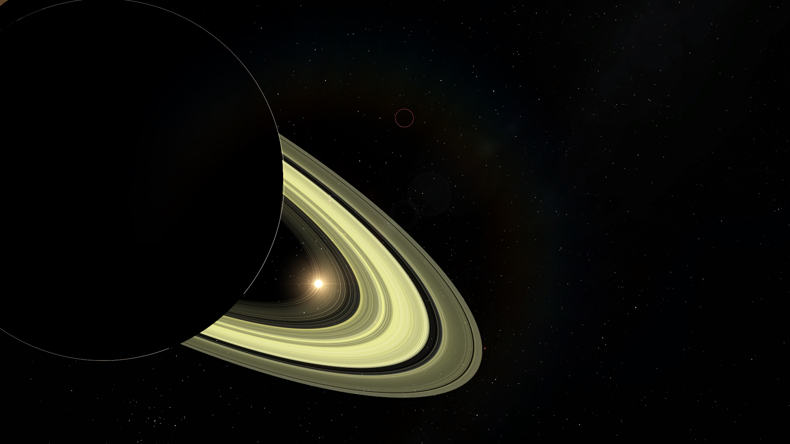

    

  

  

  

  
<h2>Table of contents</h2>

  <ul>
    <li><a href="#overview">Overview</a></li>
    <li><a href="#features">Features</a></li>
    <li><a href="#dependencies">Dependencies</a></li>
    <li><a href="#building-windows">Building (for Windows)</a></li>
    <li><a href="#limitations">Limitations</a></li>
    <li><a href="#screenshots-and-videos">Project screenshots and video snippets</a></li>
      <ul>
      <li><a href="#earth">Earth</a></li>
      <li><a href="#earth-clouds-shadow">The shadow of the clouds on Earth</a></li>
      <li><a href="#view-from-moon-to-earth">View from the Moon to Earth</a></li>
      <li><a href="#phobos-background-mars">Phobos in the background of Mars</a></li>
      <li><a href="#jupiter">Jupiter</a></li>
      <li><a href="#saturn-flyover-video">A video snippet of a flyover of Saturn</a></li>
      <li><a href="#saturn">Saturn</a></li>
      <li><a href="#saturn-with-titan-from-behind">Saturn with Titan from behind</a></li>
      <li><a href="#saturn-with-mimas-and-titan">Saturn with Mimas and Titan</a></li>
      <li><a href="#shadow-of-titan">Shadow of Titan</a></li>
      <li><a href="#uranus">Uranus</a></li>
      <li><a href="#uranus-from-behind">Uranus from behind</a></li>
      <li><a href="#triton-background-neptune">Triton in the background of Neptune</a></li>
      <li><a href="#pluto">Pluto</a></li>
      <li><a href="#sun">Sun</a></li>
      <li><a href="#sun-modified-1">Sun with modified parameters 1</a></li>
      <li><a href="#sun-modified-2">Sun with modified parameters 2</a></li>
      </ul>
  </ul>

<h2 id="overview">Overview</h2>

The project is an animated 3D scene with a model of the Solar System.

<h2 id="features">Features</h2>

- 🎮 First-person camera control with acceleration and zoom capabilities
- 🖼️ High resolution textures (8K+) with `dds` extension
- 🖼️ Photoshop-processed skybox with high resolution textures (6K)
- 💡 High-quality shaders
- 💡 Blinn–Fong reflection model with normal maps to visualise surface irregularities
- 💡 Accurate atmospheric scattering of planets and satellites
- 💡 Mie scattering and accurate shadows for planetary rings
- 💡 High-quality soft shadows using PCF and ray tracing
- 💡 Omnidirectional shadow maps simulation when using a single unidirectional shadow map
- 💡 Shadows from the clouds
- 💡 Lens flare
- 🎵 Background music
- ⚙️ A simple graphical user interface with all the information the user needs and for
  managing a small set of parameters (music volume, time control, planet and satellite hints
  control, sun parameters, etc.)
- ⚙️ Using 3D models with `obj` extension for planets, satellites, planetary rings, etc.

<h2 id="dependencies">Dependencies</h2>

- [C++17](https://en.cppreference.com/w/cpp/17)
- [OpenGL 4.6](https://www.khronos.org/registry/OpenGL/specs/gl/glspec46.core.pdf)
- [GLFW](https://github.com/glfw/glfw)
- [GLEW](https://github.com/nigels-com/glew)
- [SDL2](https://www.libsdl.org/download-2.0.php) and [SDL2_image](https://www.libsdl.org/projects/SDL_image/)
- [Assimp](https://github.com/assimp/assimp)
- [FreeType](https://gitlab.freedesktop.org/freetype/freetype)
- [irrKlang](https://www.ambiera.com/irrklang/)

<h2 id="building-windows">Building (for Windows)</h2>

Run an auxiliary script from the command line to automatically run the necessary [cmake](https://cmake.org/install/)
commands using the `.\build.sh` command, while in the directory with the root `CMakeLists.txt` file 
(the root project folder). Then an exe file with all necessary dlls will appear in the `build` folder.

<h2 id="limitations">Limitations</h2>

Due to virtual memory limitations (mainly if the executable file is compiled with a 32-bit 
compiler and uses 32-bit libraries, as in my case), a `bad_alloc` exception may be thrown when 
launching the entire Solar System at once (with all planets, satellites, etc.).

<h2 id="screenshots-and-videos">Project screenshots and video snippets</h2>

If you want to see all the beauties of the Solar System in person,
[download](https://github.com/GlebchanskyGit/SolarSystem-3D/releases) the archive and run the 
executables I've specially prepared for you.

More screenshots and video snippets can be seen [here](https://ibb.co/album/8Y7GLh?sort=date_asc&page=1).

<h3 id="earth">Earth</h3>

    

<h3 id="earth-clouds-shadow">The shadow of the clouds on Earth</h3>

    

<h3 id="view-from-moon-to-earth">View from the Moon to Earth</h3>

    

<h3 id="phobos-background-mars">Phobos in the background of Mars</h3>

    

<h3 id="jupiter">Jupiter</h3>

    

<h3 id="saturn-flyover-video">A video snippet of a flyover of Saturn</h3>

    

<h3 id="saturn">Saturn</h3>

   
    

<h3 id="saturn-with-titan-from-behind">Saturn with Titan from behind</h3>

   
    

<h3 id="saturn-with-mimas-and-titan">Saturn with Mimas and Titan</h3>

   
    

<h3 id="shadow-of-titan">Shadow of Titan</h3>

   
    

<h3 id="uranus">Uranus</h3>

   
    

<h3 id="uranus-from-behind">Uranus from behind</h3>

   
    

<h3 id="triton-background-neptune">Triton in the background of Neptune</h3>

    

<h3 id="pluto">Pluto</h3>

    

<h3 id="sun">Sun</h3>

    

<h3 id="sun-modified-1">Sun with modified parameters 1</h3>

    

<h3 id="sun-modified-2">Sun with modified parameters 2</h3>

    

